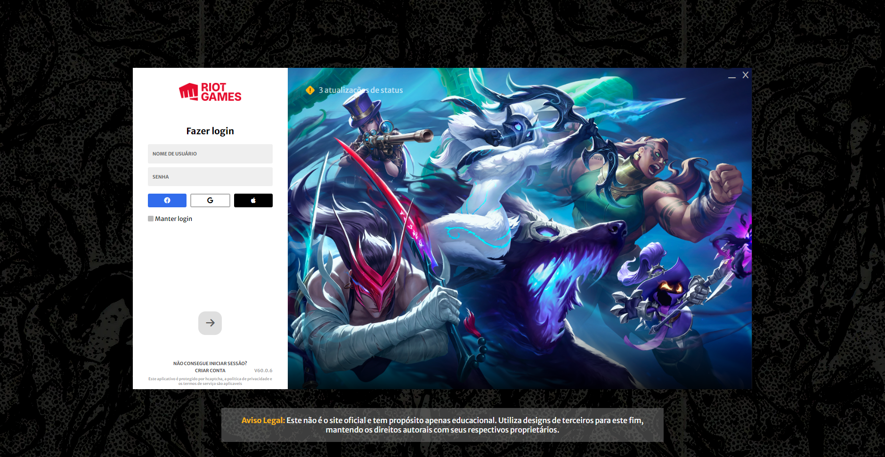
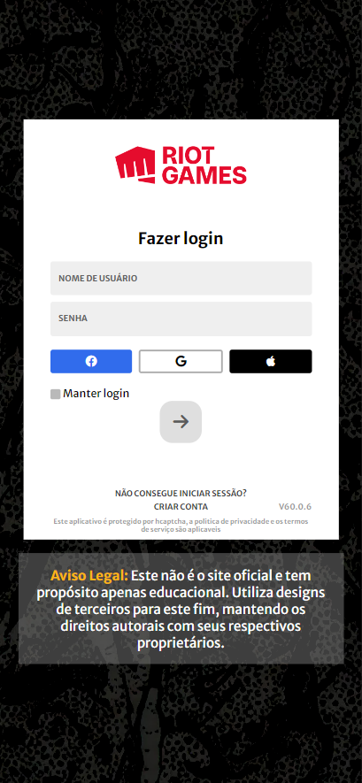

# CloneRiotLogin

## Table of contents

- [Overview](#overview)
  - [The Project](#the-Project)
  - [Screenshot](#screenshot)
- [My process](#my-process)
  - [Built with](#built-with)
  - [What I learned](#what-i-learned)
  - [Continued development](#continued-development)
  - [Useful resources](#useful-resources)
- [Author](#author)

## Overview

EDUCATIONAL PROJECT
I DO NOT OWN ANY RIGHTS OF RIOT GAMES DESIGNS

### The Project

Users should be able to:

- See hover states for all interactive elements on the page
- Interact with the alerts SOON
- Toggle between display '*' instead the true password SOON

### Screenshot

## My process

### Built with

- Semantic HTML5 markup
- CSS custom properties
- Flexbox
- CSS Grid

### What I learned

- css Grid 
- BackGround image manipulation

### Continued development

- NEXT UPDATE - FIX LOGIN BUTTON
- ADD ALERTS
- ADD TOGGLE BUTTON SHOW PASSWORD

### Useful resources

- Riot Games designs & official website

## Author

- Website - [FabrícioDG](https://www.devfabriciodg.com) *Coming soon*
- Frontend Mentor - [@FabricioDag](https://www.frontendmentor.io/profile/FabricioDag)

